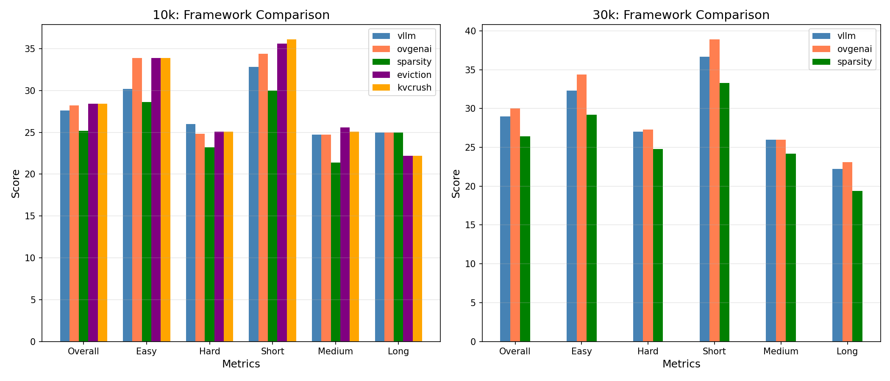
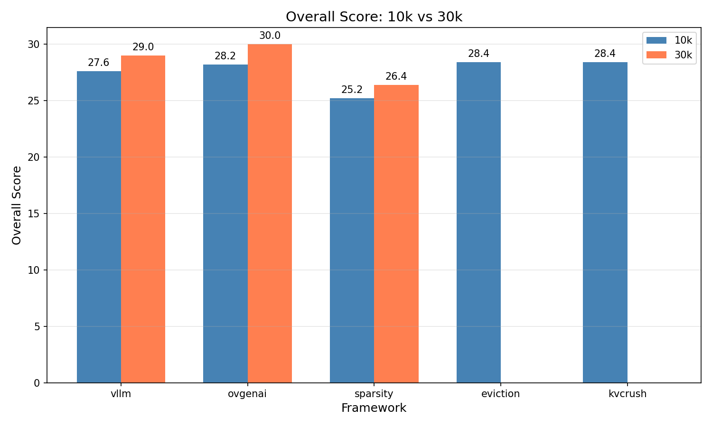
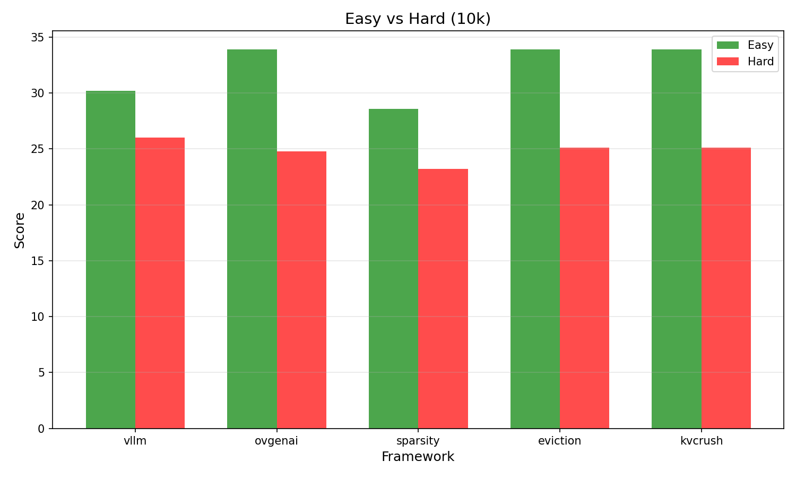

# LongBench Benchmark Analysis

## 1. Data Overview

| Framework | Max_input_token | Overall | Easy | Hard | Short | Medium | Long |
|-----------|-----------------|---------|------|------|-------|--------|------|
| vllm | 30k | 29.0 | 32.3 | 27.0 | 36.7 | 26.0 | 22.2 |
| vllm | 10k | 27.6 | 30.2 | 26.0 | 32.8 | 24.7 | 25.0 |
| ovgenai | 30k | 30.0 | 34.4 | 27.3 | 38.9 | 26.0 | 23.1 |
| sparsity | 30k | 26.4 | 29.2 | 24.8 | 33.3 | 24.2 | 19.4 |
| ovgenai | 10k | 28.2 | 33.9 | 24.8 | 34.4 | 24.7 | 25.0 |
| sparsity | 10k | 25.2 | 28.6 | 23.2 | 30.0 | 21.4 | 25.0 |
| eviction | 10k | 28.4 | 33.9 | 25.1 | 35.6 | 25.6 | 22.2 |
| kvcrush | 10k | 28.4 | 33.9 | 25.1 | 36.1 | 25.1 | 22.2 |

---

## 2. Framework Comparison

### 2.1 Overall Score Ranking

#### 10k Input Length

| Rank | Framework | Overall |
|------|-----------|---------|
| 1 | eviction | 28.4 |
| 1 | kvcrush | 28.4 |
| 3 | ovgenai | 28.2 |
| 4 | vllm | 27.6 |
| 5 | sparsity | 25.2 |

#### 30k Input Length

| Rank | Framework | Overall |
|------|-----------|---------|
| 1 | ovgenai | 30.0 |
| 2 | vllm | 29.0 |
| 3 | sparsity | 26.4 |

### 2.2 Score by Difficulty Level (10k)

| Framework | Easy | Hard | Difference |
|-----------|------|------|------------|
| eviction | 33.9 | 25.1 | +8.8 |
| kvcrush | 33.9 | 25.1 | +8.8 |
| ovgenai | 33.9 | 24.8 | +9.1 |
| vllm | 30.2 | 26.0 | +4.2 |
| sparsity | 28.6 | 23.2 | +5.4 |

### 2.3 Score by Length Category (10k)

| Framework | Short | Medium | Long |
|-----------|-------|--------|------|
| eviction | 35.6 | 25.6 | 22.2 |
| kvcrush | 36.1 | 25.1 | 22.2 |
| ovgenai | 34.4 | 24.7 | 25.0 |
| vllm | 32.8 | 24.7 | 25.0 |
| sparsity | 30.0 | 21.4 | 25.0 |

---

## 3. 10k vs 30k Analysis

### 3.1 vllm: 10k → 30k

| Metric | 10k | 30k | Change |
|--------|-----|-----|--------|
| Overall | 27.6 | 29.0 | **+1.4** |
| Easy | 30.2 | 32.3 | +2.1 |
| Hard | 26.0 | 27.0 | +1.0 |
| Short | 32.8 | 36.7 | +3.9 |
| Medium | 24.7 | 26.0 | +1.3 |
| Long | 25.0 | 22.2 | **-2.8** |

### 3.2 ovgenai: 10k → 30k

| Metric | 10k | 30k | Change |
|--------|-----|-----|--------|
| Overall | 28.2 | 30.0 | **+1.8** |
| Easy | 33.9 | 34.4 | +0.5 |
| Hard | 24.8 | 27.3 | +2.5 |
| Short | 34.4 | 38.9 | +4.5 |
| Medium | 24.7 | 26.0 | +1.3 |
| Long | 25.0 | 23.1 | **-1.9** |

---

## 4. Key Findings

### 4.1 Best Strategy by Scenario

| Scenario | Best Framework | Score |
|----------|----------------|-------|
| 10k Overall | eviction / kvcrush | 28.4 |
| 30k Overall | ovgenai | 30.0 |
| 10k Easy | eviction / kvcrush / ovgenai | 33.9 |
| 30k Easy | ovgenai | 34.4 |
| 10k Short | kvcrush | 36.1 |
| 30k Short | ovgenai | 38.9 |

### 4.2 Key Observations

1. **ovgenai dominates at 30k**: Best overall score (30.0) and best on Short/Medium categories
2. **eviction/kvcrush tie at 10k**: Both achieve 28.4 overall
3. **sparsity underperforms**: Lowest scores across both 10k and 30k
4. **vllm as baseline**: Stable performance, neither best nor worst
5. **Long category degradation**: All frameworks show lower scores on Long at 30k

---

## 5. Conclusion

### 5.1 Strategy Selection Guide

| Scenario | Recommended | Reason |
|----------|-------------|--------|
| Short prompts (10k) | eviction / kvcrush | Best overall score |
| Long prompts (30k) | ovgenai | Best overall score |
| Short output | ovgenai (30k) | 38.9 (highest) |
| Long output | vllm / ovgenai | 25.0 at 10k |
| Hard tasks | vllm | Most robust on Hard difficulty |
| Easy tasks | ovgenai / eviction / kvcrush | ~34 |

### 5.2 Summary

- **ovgenai**: Best for long context (30k) scenarios, excellent on short outputs
- **eviction/kvcrush**: Best for shorter context (10k), tied at 28.4
- **sparsity**: Avoid - consistently underperforms other strategies
- **vllm**: Reliable baseline with stable performance across all scenarios

---

## 6. Generated Charts

---

*Analysis Date: 2026-03-16*
