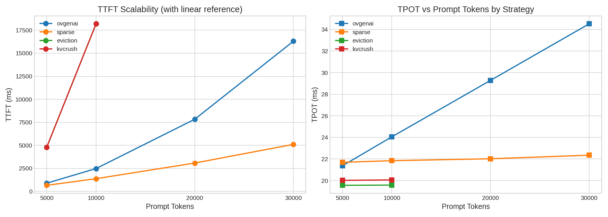
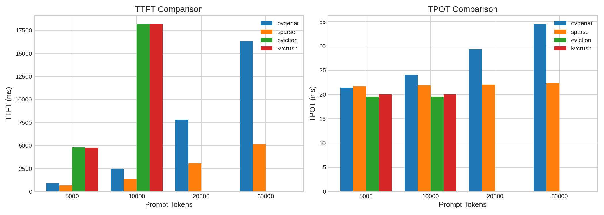

# KV Cache Strategy Performance Benchmark Analysis

## 1. Data Overview

| name | prompt_tokens | output_tokens | max_num_batched_tokens | ttft_ms | tpot_ms |
|------|--------------|---------------|------------------------|---------|---------|
| ovgenai | 10000 | 1024 | 1024 | 2479.83 | 24.05 |
| sparse | 10000 | 1024 | 1024 | 1379.67 | 21.84 |
| eviction | 10000 | 1024 | 1024 | 18189.45 | 19.58 |
| kvcrush | 10000 | 1024 | 1024 | 18188.34 | 20.06 |
| ovgenai | 20000 | 1024 | 1024 | 7831.55 | 29.28 |
| sparse | 20000 | 1024 | 1024 | 3075.95 | 22.02 |
| ovgenai | 30000 | 1024 | 1024 | 16302.61 | 34.52 |
| sparse | 30000 | 1024 | 1024 | 5105.02 | 22.35 |
| ovgenai | 5000 | 1024 | 1024 | 890.28 | 21.37 |
| sparse | 5000 | 1024 | 1024 | 658.78 | 21.69 |
| eviction | 5000 | 1024 | 1024 | 4788.37 | 19.56 |
| kvcrush | 5000 | 1024 | 1024 | 4786.88 | 20.02 |

---

## 2. Strategy Comparison

### 2.1 TTFT (Time to First Token) Comparison

| prompt_tokens | eviction | kvcrush | ovgenai | sparse |
|--------------|-----------|----------|---------|--------|
| 5000 | 4788.37 | 4786.88 | 890.28 | **658.78** |
| 10000 | 18189.45 | 18188.34 | 2479.83 | **1379.67** |
| 20000 | - | - | 7831.55 | **3075.95** |
| 30000 | - | - | 16302.61 | **5105.02** |

**Best Strategy**: **sparse** has the best TTFT at all prompt lengths.

### 2.2 TPOT (Time Per Output Token) Comparison

| prompt_tokens | eviction | kvcrush | ovgenai | sparse |
|--------------|-----------|----------|---------|--------|
| 5000 | **19.56** | 20.02 | 21.37 | 21.69 |
| 10000 | **19.58** | 20.06 | 24.05 | 21.84 |
| 20000 | - | - | 29.28 | **22.02** |
| 30000 | - | - | 34.52 | **22.35** |

---

## 3. TPOT Stability Analysis

| Strategy | 5k TPOT | 30k TPOT | Growth   |
| -------- | ------- | -------- | -------- |
| sparse   | 21.69ms | 22.35ms  | +3%      |
| ovgenai  | 21.37ms | 34.52ms  | **+62%** |

**Conclusion**: sparse's TPOT remains stable regardless of prompt length, while ovgenai's TPOT degrades significantly with longer prompts.

## Summary

1. **sparse has the best scalability**: TTFT grows only 7.75x from 5k to 30k, while ovgenai grows 18.31x
2. **eviction/kvcrush has the best TPOT** (~20ms), but TTFT is too high (4-18 seconds) - suitable for scenarios where first-token latency is not critical

---

*Analysis Date: 2026-03-16*
