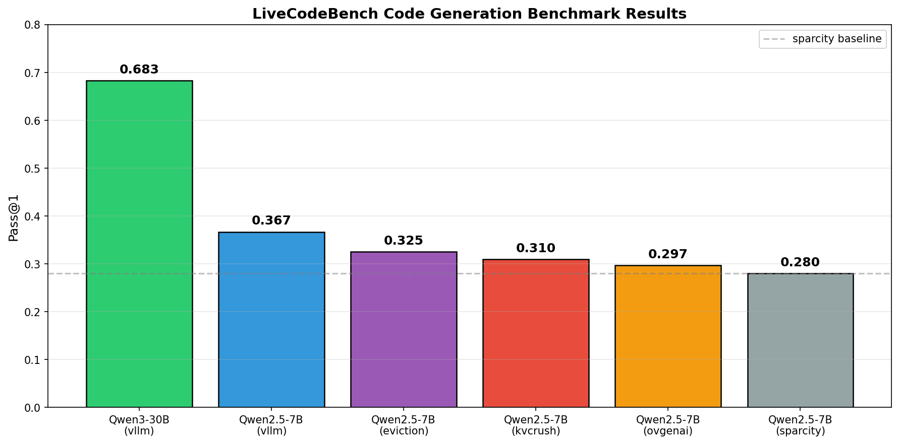

# LiveCodeBench 代码生成评测结果报告

## 📊 数据概览

| 模型 | 框架 | Pass@1 |
|------|------|--------|
| Qwen3-30B-A3B-Instruct-2507 | vllm | **0.683** |
| Qwen2.5-7B-Instruct | vllm | 0.367 |
| Qwen2.5-7B-Instruct | eviction | 0.325 |
| Qwen2.5-7B-Instruct | kvcrush | 0.310 |
| Qwen2.5-7B-Instruct | ovgenai | 0.297 |
| Qwen2.5-7B-Instruct | sparcity | 0.280 |

---

## 📈 可视化分析




```

### Qwen2.5-7B 各框架性能排名

```
1st  eviction   ████████████████████ 0.325  +16.1%
2nd  kvcrush    ███████████████████  0.310  +10.7%
3rd  ovgenai    ██████████████████   0.297   +6.1%
4th  sparcity   █████████████████    0.280   (baseline)
```

---

## 🔍 关键发现

### 1. 模型规模影响显著
- **Qwen3-30B (vllm)** 达到 **68.3%** Pass@1，领先 Qwen2.5-7B 约 **31.6 个百分点**
- 大模型在代码生成任务上优势明显


---

## 📝 结论

1. **vllm** 框架在代码生成任务上表现最佳
2. 大模型 (30B) 显著优于小模型 (7B)
3. 在 7B 模型中，稀疏化方案 **eviction** > **kvcrush** > **ovgenai** > **sparcity**
4. openvino相比 vllm 仍有 **11%-24%** 的性能差距，可能原因vllm是fp16模型，openvino genai是int8模型

---

*报告生成时间: 2026-03-17*
