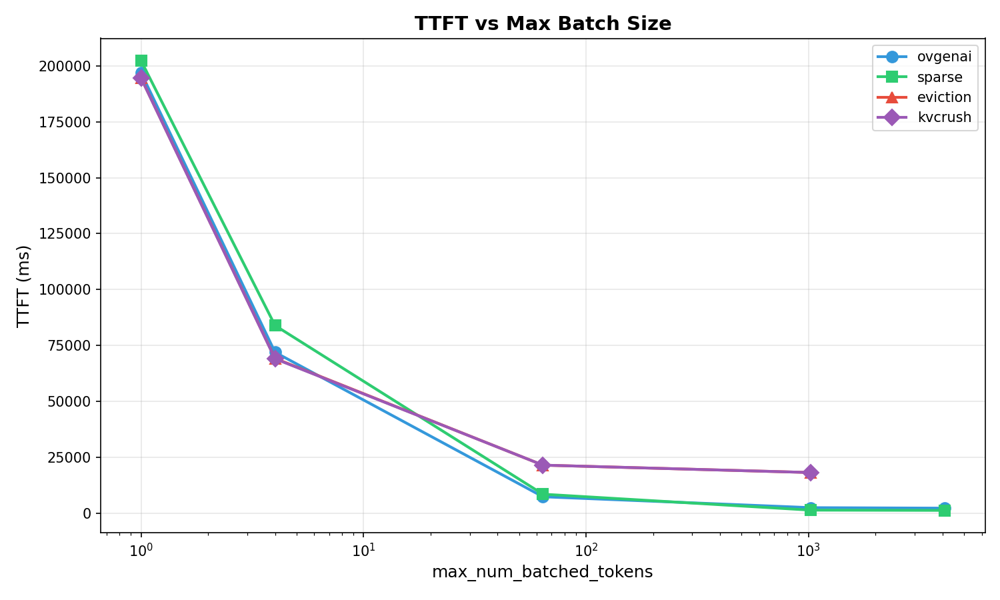
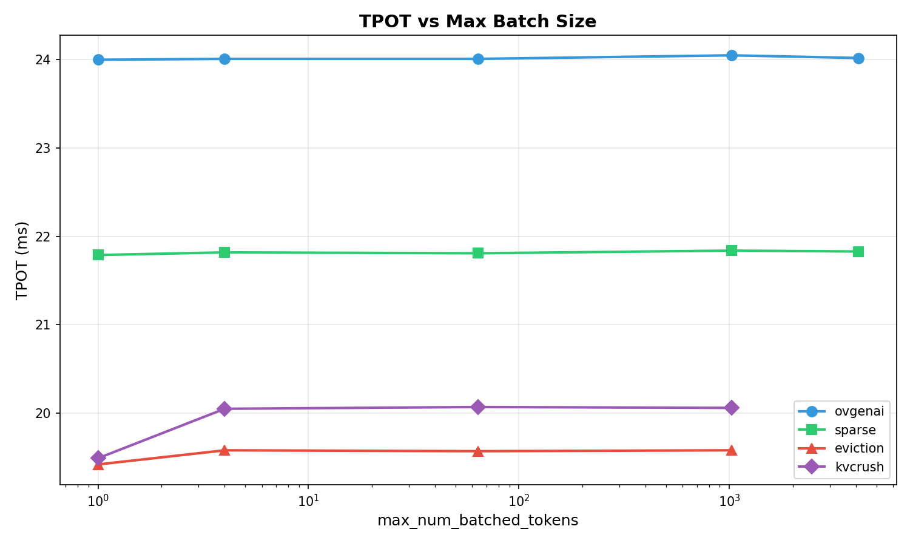

# Max Batch 4K 性能测试报告

## 📊 测试配置

- **Prompt Tokens:** 10000
- **Output Tokens:** 1024
- **测试框架:** ovgenai, sparse, eviction, kvcrush

---

## 📈 TTFT (Time To First Token) 分析

### TTFT 汇总 (ms)

| max_num_batched_tokens | ovgenai | sparse | eviction | kvcrush |
|------------------------|---------|--------|----------|---------|
| 1                      | 196,927 | 202,266 | 194,634 | 194,529 |
| 4                      | 71,961  | 83,924 | 69,224  | 69,052  |
| 64                     | 7,359   | 8,504  | 21,495  | 21,498  |
| 1024                   | 2,480   | 1,380  | 18,189  | 18,188  |
| 4096                   | 2,257   | 1,268  | -        | -        |

### 关键发现

1. **ovgenai/sparse**: TTFT 随 batch size 增加显著下降，4096 时仅 ~1.3-2.3s
2. **eviction/kvcrush**: TTFT 相对稳定，batch size 影响较小，始终在 18-21s
3. **batch=64** 是分水岭：ovgenai/sparse 在此点开始大幅优化

---

## ⚡ TPOT (Time Per Output Token) 分析

### TPOT 汇总 (ms)

| max_num_batched_tokens | ovgenai | sparse | eviction | kvcrush |
|------------------------|---------|--------|----------|---------|
| 1                      | 24.00   | 21.79  | 19.42    | 19.49   |
| 4                      | 24.01   | 21.82  | 19.58    | 20.05   |
| 64                     | 24.01   | 21.81  | 19.57    | 20.07   |
| 1024                   | 24.05   | 21.84  | 19.58    | 20.06   |
| 4096                   | 24.02   | 21.83  | -        | -        |

### 关键发现

1. **TPOT 相对稳定**: 各框架的 TPOT 受 batch size 影响很小
2. **框架差异明显**:
   - ovgenai: ~24ms (最慢)
   - sparse: ~21.8ms
   - eviction/kvcrush: ~19.5-20ms (最快)
3. eviction/kvcrush 在 TPOT 上有明显优势

---

## 🎯 结论

| 指标 | 最优框架 | 说明 |
|------|----------|------|
| TTFT (大 batch) | **sparse** | batch=4096 时仅 1.27s |
| TTFT (小 batch) | **eviction/kvcrush** | batch=1-4 时约 69-195s |
| TPOT | **eviction/kvcrush** | ~19.5ms，最快 |

**推荐场景**:
- **高并发**: 用 sparse/ovgenai (TTFT 短)
- **低延迟**: 用 eviction/kvcrush (TPOT 短)

---

*报告更新: 2026-03-17*
