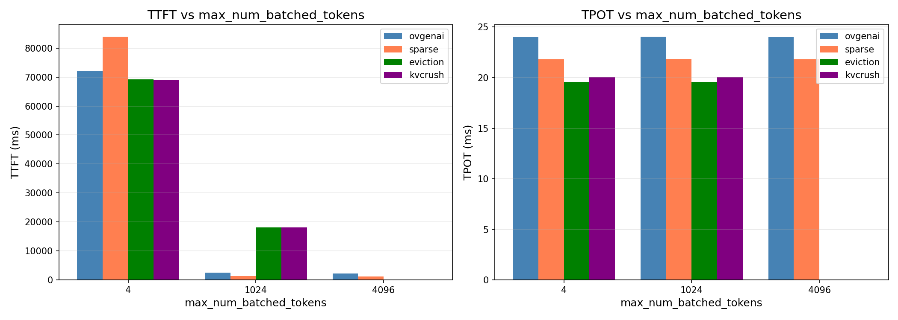
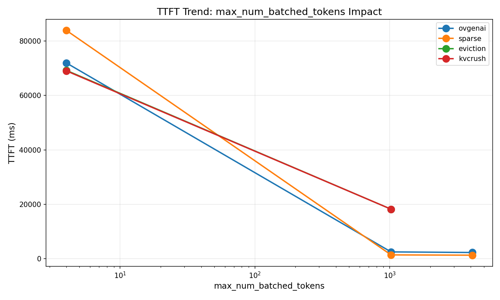

# Max Num Batched Tokens Impact Analysis

## 1. Data Overview

| model | prompt_tokens | output_tokens | max_num_batched_tokens | ttft_ms | tpot_ms |
|-------|--------------|---------------|------------------------|---------|---------|
| ovgenai | 10000 | 1024 | 1024 | 2479.83 | 24.05 |
| sparse | 10000 | 1024 | 1024 | 1379.67 | 21.84 |
| eviction | 10000 | 1024 | 1024 | 18189.45 | 19.58 |
| kvcrush | 10000 | 1024 | 1024 | 18188.34 | 20.06 |
| ovgenai | 10000 | 1024 | 4096 | 2256.68 | 24.02 |
| sparse | 10000 | 1024 | 4096 | 1267.72 | 21.83 |
| ovgenai | 10000 | 1024 | 4 | 71960.77 | 24.01 |
| sparse | 10000 | 1024 | 4 | 83924.12 | 21.82 |
| eviction | 10000 | 1024 | 4 | 69224.30 | 19.58 |
| kvcrush | 10000 | 1024 | 4 | 69051.80 | 20.05 |

---

## 2. Impact Analysis: max_num_batched_tokens

### 2.1 TTFT by max_num_batched_tokens

| Model | max_batch=4 | max_batch=1024 | max_batch=4096 |
|-------|-------------|----------------|-----------------|
| ovgenai | 71960.77ms | 2479.83ms | 2256.68ms |
| sparse | 83924.12ms | 1379.67ms | 1267.72ms |
| eviction | 69224.30ms | 18189.45ms | - |
| kvcrush | 69051.80ms | 18188.34ms | - |

### 2.2 TTFT Change (relative to max_batch=1024)

| Model | max_batch=4 | max_batch=1024 | max_batch=4096 |
|-------|-------------|----------------|-----------------|
| ovgenai | **29.02x** | 1.00x (baseline) | **0.91x** |
| sparse | **60.83x** | 1.00x (baseline) | **0.92x** |
| eviction | **3.81x** | 1.00x (baseline) | - |
| kvcrush | **3.80x** | 1.00x (baseline) | - |

### 2.3 TPOT Stability

| Model | max_batch=4 | max_batch=1024 | max_batch=4096 |
|-------|-------------|----------------|-----------------|
| ovgenai | 24.01ms | 24.05ms | 24.02ms |
| sparse | 21.82ms | 21.84ms | 21.83ms |
| eviction | 19.58ms | 19.58ms | - |
| kvcrush | 20.05ms | 20.06ms | - |

**TPOT change**: < 1% across all strategies and batch sizes

---

## 3. Key Findings

### 3.1 TTFT Degradation at max_batch=4

All strategies show significant TTFT increase when max_num_batched_tokens is reduced to 4:

| Strategy | TTFT Increase | Sensitivity |
|----------|---------------|-------------|
| sparse | 60.83x | **Highest** |
| ovgenai | 29.02x | High |
| eviction | 3.81x | Moderate |
| kvcrush | 3.80x | Moderate |

- **sparse** is the most sensitive to small batch size
- **eviction/kvcrush** show relatively stable performance

### 3.2 TTFT Improvement at max_batch=4096

For strategies tested with max_batch=4096:

| Strategy | TTFT Improvement |
|----------|-----------------|
| ovgenai | -9% (2256ms vs 2479ms) |
| sparse | -8% (1268ms vs 1380ms) |

Larger batch size allows better batching optimization, reducing TTFT.

### 3.3 TPOT is Independent

- TPOT remains stable regardless of max_num_batched_tokens
- All strategies maintain consistent per-token latency (~19-24ms)
- This makes sense: TPOT depends on decoding, not batching configuration

---

## 4. Conclusion

### 4.1 Batch Size Sensitivity

| Strategy | Sensitivity to small batch | Recommendation |
|----------|---------------------------|----------------|
| sparse | Very High (60x) | Avoid very small batch sizes |
| ovgenai | High (29x) | Avoid very small batch sizes |
| eviction | Moderate (3.8x) | More robust to small batches |
| kvcrush | Moderate (3.8x) | More robust to small batches |

### 4.2 Practical Recommendations

1. **Avoid max_num_batched_tokens=4**: Causes 4-60x TTFT increase
2. **Use larger batch sizes when possible**: max_batch=4096 improves TTFT by ~8-9%
3. **Choose eviction/kvcrush for latency-critical small batch scenarios**: More robust to batch size changes
4. **TPOT is not affected by batch size**: Decoding performance is independent

---

## 5. Generated Charts

---

*Analysis Date: 2026-03-16*
