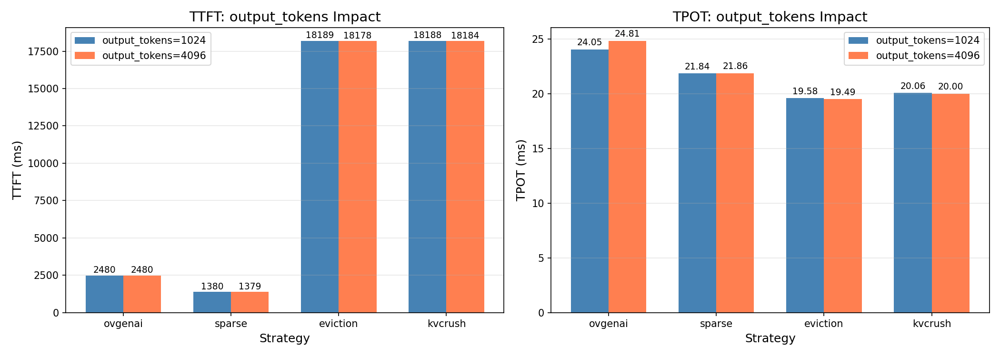
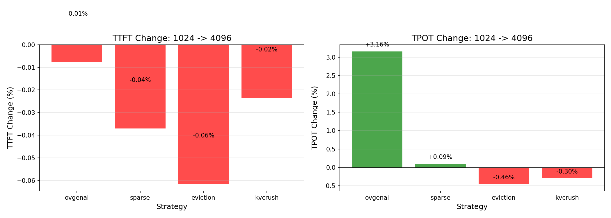

# Output Tokens Impact Analysis

## 1. Data Overview

| model | prompt_tokens | output_tokens | max_num_batched_tokens | ttft_ms | tpot_ms |
|-------|--------------|---------------|------------------------|---------|---------|
| ovgenai | 10000 | 1024 | 1024 | 2479.83 | 24.05 |
| sparse | 10000 | 1024 | 1024 | 1379.67 | 21.84 |
| eviction | 10000 | 1024 | 1024 | 18189.45 | 19.58 |
| kvcrush | 10000 | 1024 | 1024 | 18188.34 | 20.06 |
| ovgenai | 10000 | 4096 | 1024 | 2479.64 | 24.81 |
| sparse | 10000 | 4096 | 1024 | 1379.16 | 21.86 |
| eviction | 10000 | 4096 | 1024 | 18178.26 | 19.49 |
| kvcrush | 10000 | 4096 | 1024 | 18184.07 | 20.00 |

---

## 2. Impact Analysis: output_tokens 1024 -> 4096

### 2.1 TTFT Change

| Model | TTFT @ 1024 | TTFT @ 4096 | Change |
|-------|-------------|-------------|--------|
| ovgenai | 2479.83ms | 2479.64ms | **-0.01%** |
| sparse | 1379.67ms | 1379.16ms | **-0.04%** |
| eviction | 18189.45ms | 18178.26ms | **-0.06%** |
| kvcrush | 18188.34ms | 18184.07ms | **-0.02%** |

### 2.2 TPOT Change

| Model | TPOT @ 1024 | TPOT @ 4096 | Change |
|-------|-------------|-------------|--------|
| ovgenai | 24.05ms | 24.81ms | **+3.16%** |
| sparse | 21.84ms | 21.86ms | **+0.09%** |
| eviction | 19.58ms | 19.49ms | **-0.46%** |
| kvcrush | 20.06ms | 20.00ms | **-0.30%** |

---

## 3. Key Findings

### 3.1 TTFT is Nearly Unchanged

- All strategies show < 0.1% change in TTFT when output_tokens increases from 1024 to 4096
- This makes sense: **TTFT only depends on prompt processing**, not output length
- The KV cache is fully populated before the first token is generated

### 3.2 TPOT Impact is Minimal

| Strategy | TPOT Sensitivity |
|----------|-----------------|
| ovgenai | +3.16% (slight increase) |
| sparse | +0.09% (negligible) |
| eviction | -0.46% (slight improvement) |
| kvcrush | -0.30% (negligible) |

- Only ovgenai shows a noticeable but still small increase (+3.16%)
- Other strategies remain essentially unchanged

---

## 4. Conclusion

**output_tokens has minimal impact on both TTFT and TPOT:**

1. **TTFT independence**: First-token latency is determined solely by prompt processing, not by how many tokens will be generated

2. **Stable TPOT**: The per-token latency remains stable regardless of output length

3. **Strategy-agnostic**: All KV cache strategies show consistent behavior across different output_tokens values

4. **Practical implication**: When optimizing for KV cache strategies, output_tokens does not need to be a primary consideration

---

## 5. Generated Charts

---

*Analysis Date: 2026-03-16*
